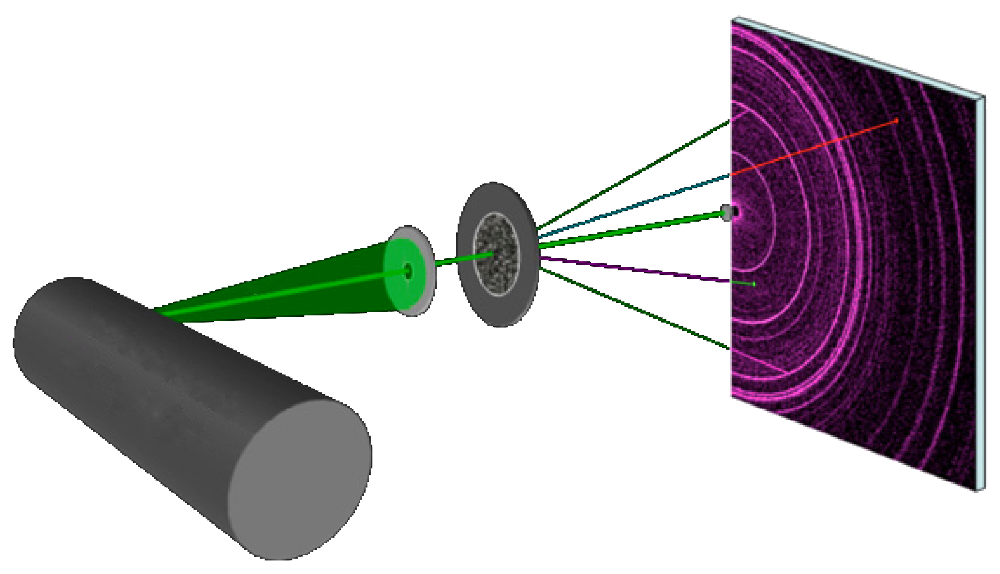
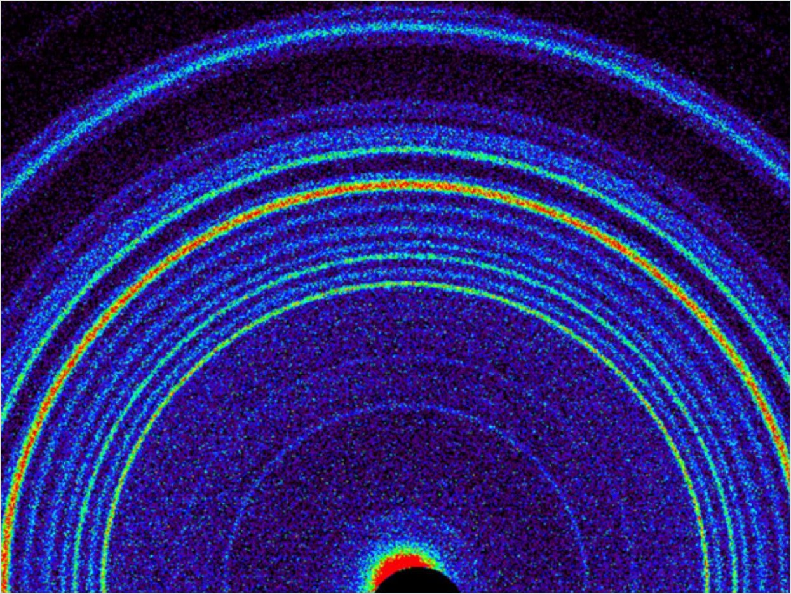
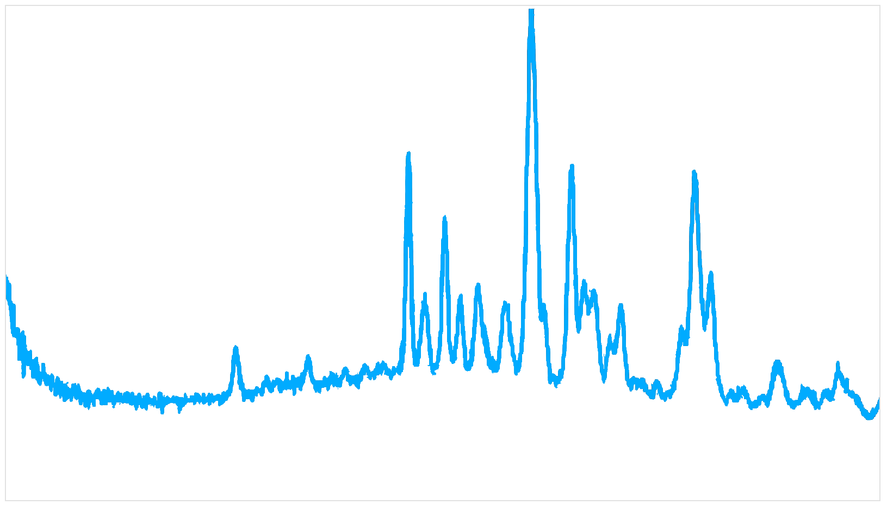
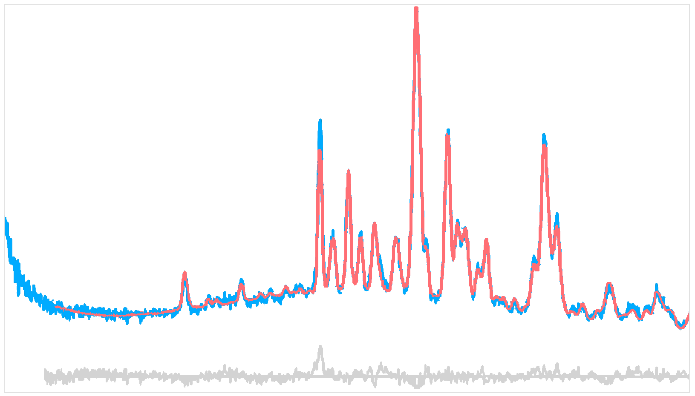
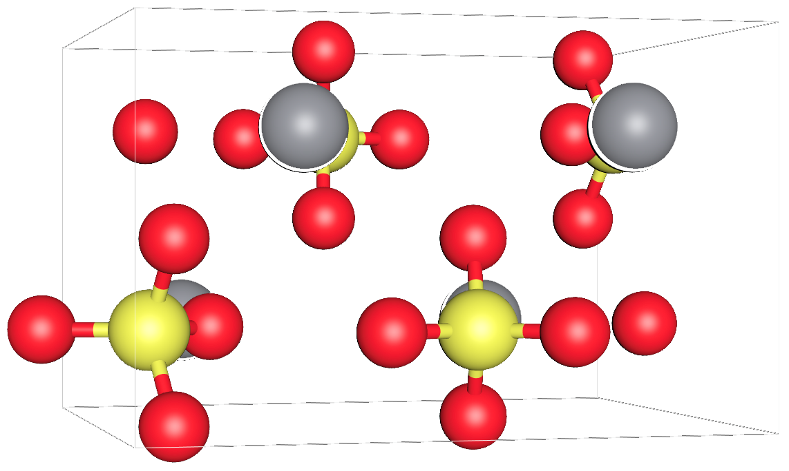

# Concept

Typical data processing in a diffraction experiment consists of three main steps:  
**data acquisition**, **data reduction**, and **data analysis**.

```mermaid
flowchart LR
    a(Data Aquisition)
    b(Data Reduction)
    c(Data Analysis)
    a --> b
    b --> c
```

## Data Acquisition

Data acquisition involves collecting raw data from the diffractometer
(also referred to as the instrument) during a neutron or X-ray diffraction experiment.

The data is recorded by a detector that measures the intensity of the diffracted
radiation as a function of angle or time. The radiation is scattered by the
crystalline specimen (also called the sample), whose structural properties are being studied.

{ width="450", loading=lazy }
/// caption
An illustration of the data acquisition step, where raw data is collected
by a 2D detector. The studied sample originates from Mars. Credits: DOI 10.1126/science.1238932
///

{ width="400", loading=lazy }
/// caption
A 2D diffraction pattern collected by the detector. Credits: DOI 10.1126/science.1238932
///

## Data Reduction

Data reduction involves processing the raw data to remove background noise,
correct for instrumental effects, and convert the data into a more usable format.
The goal is to produce a clean and reliable dataset suitable for analysis.

{ width="450", loading=lazy }
/// caption
An illustration of a 1D diffraction pattern reduced from the measured 2D data. Credits: DOI 10.1126/science.1238932
///

## Data Analysis

Data analysis uses the reduced data to extract meaningful information
about the sample. This may include determining the crystal or magnetic structure,
identifying phases, performing quantitative analysis, etc.

Analysis often involves comparing experimental data with data calculated
from a crystallographic model to validate and interpret the results. For powder diffraction, techniques such as Rietveld or Le Bail refinement may be used.

In EasyDiffraction, we focus on this **model-dependent analysis**.
A model is built using prior knowledge of the system, and its parameters are optimized
to achieve the best agreement between experimental and calculated diffraction data.

By "model", we usually refer to a **crystallographic model** of the sample.
This includes unit cell parameters, space group, atomic positions, thermal parameters, and more.
However, the term "model" also encompasses experimental aspects such as instrumental resolution,
background, peak shape, etc. Therefore, EasyDiffraction separates the model into two parts:
the **sample model** and the **experiment**.

The aim of data analysis is to refine the structural parameters of the sample
by minimizing the difference (or **residual**) between the experimental and calculated data —
and this is exactly where EasyDiffraction comes into play.

{ width="450", loading=lazy }
/// caption
An illustration of the data analysis step: the experimental data (blue)
is compared to the calculated data (red), and the residual (gray) is minimized. Credits: 
DOI 10.1126/science.1238932
///

{ width="450", loading=lazy }
/// caption
An example of a crystal structure model of the studied sample.
///
